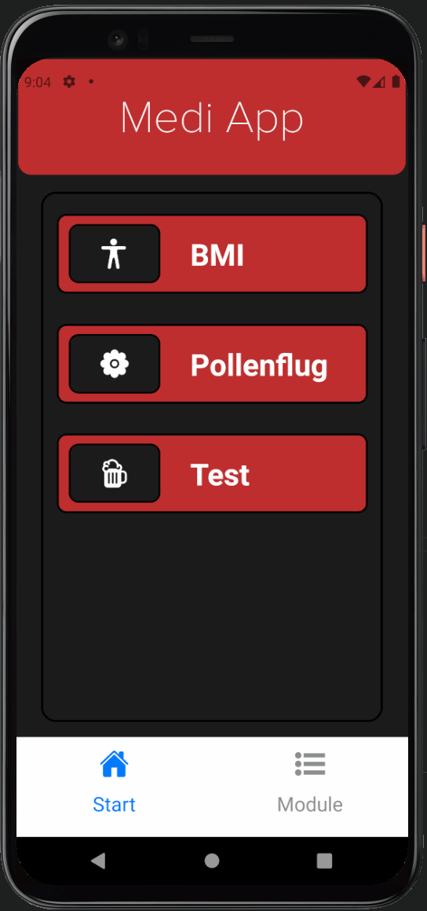

# Medi App

Medi App is a modular health &amp; nutrition app that helps the user with medical matters.

## Short Description
The user can select his favorites from a list of existing modules (BMI calculator, pollen count, etc.) and access them in a clear home screen.  As a result, the user does not have to install countless different apps, but can instead bundle them compactly in one app.  The app can easily be supplemented with additional modules.

## Screenshots

     
     

     
     

### Installation
Download and unzip the ZIP archive.  Install via "npm install".
